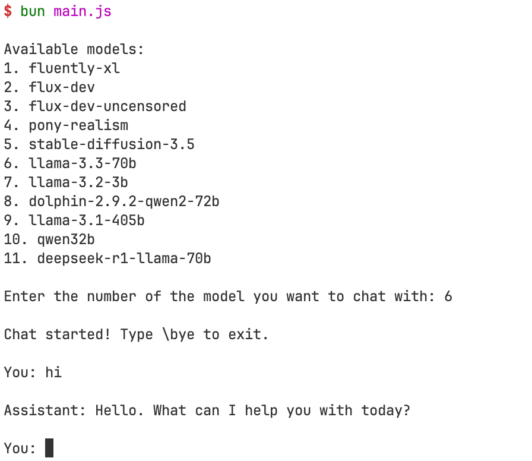

# Venice AI CLI Tool

A simple command-line interface (CLI) tool to interact with Venice AI API. This project provides a minimal example of how to integrate with Venice AI, making it easy to get started and understand the basics of the API.

## Requirements

- **pnpm**: For package management and dependency installation.
- **bun**: For running the tool.

## Installation & Usage

1. Clone the repository.
2. Install dependencies using:
   ```bash
   pnpm i
   ```
3. Copy the .env.example file and rename it to .env, then add your API key.
4. Run the tool using:
   ```bash
   bun main.js
   ```

## Features

- **Simple & Lightweight**: Less than 100 lines of code.
- **Command-Line Interface**: Easy to use and interact with Venice AI directly from your terminal.
- **Minimal Dependencies**: Keeps things simple and fast.

## Why Use This Tool?

This tool is designed to be a starting point for developers who want to learn how to interact with Venice AI's API. Its simplicity makes it a great educational resource and a foundation for building more complex applications.



## Exit Command

To exit the chat, simply type:
```
\bye
```

## Contributions

Contributions are welcome! Feel free to fork the repository and submit pull requests with improvements or additional features you'd like to see.